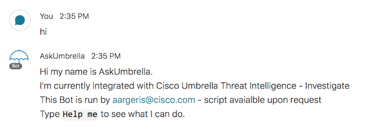

         
# Cisco Umbrella Investigate Webex Teams Bot
  
This repo contains a Python script that creates a Webex Teams Bot integrated with Cisco Umbrella Investigate. To run this script, you need a [Webex Developer account](https://developer.webex.com/login), and to follow this documentation to [create a Bot](https://developer.webex.com/docs/bots). 

This script will use a Webex Teams Room to log every message sent to and from your Bot. So you will also need to create a room in Webex Teams and include your new Bot in it. Use this [API call](https://developer.webex.com/docs/api/v1/rooms/list-rooms) to find the roomId. 

A [Cisco Umbrella Investigate API](https://docs.umbrella.com/investigate-api/docs/introduction-to-cisco-investigate) access token is also required.

The Bot has access control built-in. Make sure to modify the `webex-domain` variable to get access.

Make sure to add your webhook using https://developer.webex.com/docs/api/v1/webhooks/create-a-webhook.

This repository contains a Umbrella icon for your Bot, [umbrella.png](./umbrella.png)

Please contact me at <alexandre@argeris.net> if you have any questions or remarks. If you find any bugs, please report them to me, and I will correct them. 
  
### VARIABLES TO MODIFY BEFORE RUNNING THE SCRIPT
  

### CONTROLING ACCESS TO YOUR BOT

### EXAMPLES
GETTING message:

LISTING available commands:

LISTING TOP world wide domains view by Umbrella:

QUERY Umbrella Investigate for a domain:

