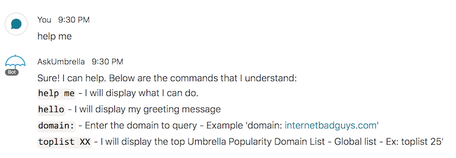
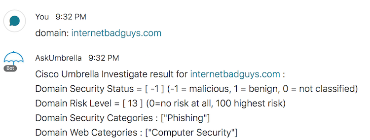

         
# Cisco Umbrella Investigate Webex Teams Bot
  
This repo contains a Python script that create a Webex Teams Bot integrated with Cisco Umbrella Investigate. To run this script you will need a account on Developper.Webex (https://developer.webex.com/login) and follow the docuementation to create a Bot (https://developer.webex.com/docs/bots). This script will also use a Webex Teams Room to log every message send to and from your Bot. So you will need to create a room in Webex Teams and include your new Bot in it. Use this API reference tool (https://developer.webex.com/docs/api/v1/rooms/list-rooms) to find the roomId. A Cisco Umbrella Investigate API access token is also require (https://docs.umbrella.com/investigate-api/docs/introduction-to-cisco-investigate).

This Bot have a access control build-in. Make sure to modify the 'webex-domain' to get access.

I have also include in this repository a Umbrella icon for your Bot 'umbrella.png'.

Please contact me at alexandre@argeris.net, if you have any questions or remarks. If you find any bugs, please report them to me, and I will correct them. 
  
### VARIABLES TO MODIFY BEFORE RUNNING THE SCRIPT
  

### CONTROLING ACCESS TO YOUR BOT

### EXAMPLES
GRETTING message:

LISTING available commands:

LISTING TOP domain view by World wide by Umbrella:

QUERY Umbrella Investigate for a domain:

