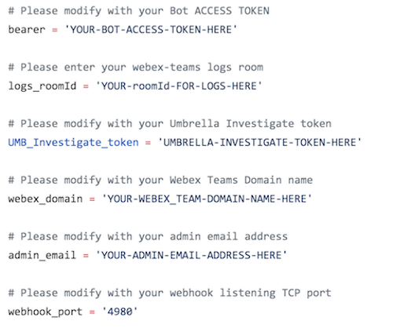

         
# Cisco Umbrella Investigate Webex Teams Bot
  
This repo contains a Python script that create a Webex Teams Bot integrated with Cisco Umbrella Investigate. 
  
Please contact me at alexandre@argeris.net, if you have any questions or remarks. If you find any bugs, please report them to me, and I will correct them. 
  
### VARIABLES TO MODIFY BEFORE RUNNING THE SCRIPT
  

### EXAMPLES
GRETTING message:

LISTING available commands:

LISTING TOP domain view by World wide by Umbrella:

